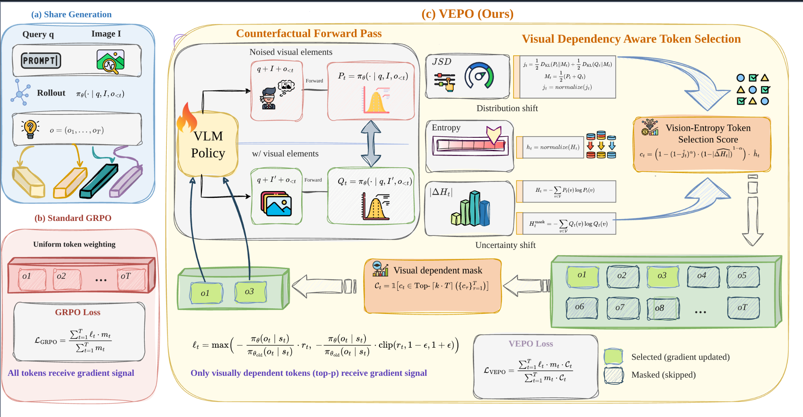

# VEPO: Unlocking Effective Reinforcement Learning for Visual Reasoning via Vision-Anchored Token Selection

The code for paper: **VEPO: Unlocking Effective Reinforcement Learning for Visual Reasoning via Vision-Anchored Token Selection**.

VEPO improves reinforcement learning for vision-language models by selectively training on visually-grounded tokens. It uses Jensen-Shannon Divergence (JSD) between normal and counterfactual (noisy/no-image) forward passes to identify tokens that depend on visual information, then focuses policy gradient updates on these important tokens.


<div align="center">
  
</div>


## Installation

```bash
# Clone the repository
git clone https://github.com/YOUR_REPO/VEPO.git
cd VEPO

conda create -n vepo python=3.11 -y && conda activate vepo
pip install torch,transformers,
pip install google-generativeai
pip install vllm
pip install flash-attention

pip install -e .
```

### Requirements

- Python >= 3.8
- PyTorch == 2.5.1
- Transformers == 4.49.0
- vLLM >= 0.7.3
- Ray
- Flash-Attention >= 2.4.3
- Numpy == 1.26.4

See `requirements.txt` for the full list.


## Training

### Quick Start

```bash
# Edit run_train.sh with your paths and settings, then:
bash run_train.sh
```

### Key Configuration

The primary VEPO hyperparameters in `run_train.sh`:

```bash
NOISY_IMAGE_MODE=gaussian       # Counterfactual: "gaussian" or "no_image"
JSD_MASK_TOP_P=0.2              # Select top 20% tokens for training
JSD_MASK_SCORE_TYPE=D           # Selection formula (A/B/C/D/E/F/G/H)
JSD_MASK_ALPHA=0.7              # JSD vs ΔH trade-off
JSD_MASK_MODE=mask             
```

## Evaluation

### Quick Start

```bash
# 1. Merge FSDP checkpoint
python scripts/model_merger.py --local_dir YOUR_CHECKPOINT/actor

# 2. Run evaluation
bash run_eval.sh
```

For detailed evaluation setup including data preparation, see [`eval/README.md`](eval/README.md).

## Method

VEPO consists of three key components:

1. **Counterfactual Forward Pass**: For each response generated with the real image, we perform an additional forward pass with a perturbed image (Gaussian noise or zero pixels) to obtain counterfactual logits.

2. **Joint Vision-Entropy Token Selection**: At each token position, we compute:
   - **JSD**: Jensen-Shannon Divergence between normal and counterfactual output distributions
   - **Entropy (H)**: Shannon entropy of the normal distribution
   - **Entropy Gap (ΔH)**: Difference in entropy between counterfactual and normal passes

   These signals are combined into a per-token importance score (default: Score Type D):

```
s_t = (1 - (1-ĵ_t)^α · (1-|ΔĤ_t|)^(1-α)) · ĥ_t
```


3. **Selective Policy Gradient**: Only the top-p fraction of tokens (ranked by importance score) receive policy gradient updates, focusing learning on visually-grounded reasoning steps.


## License

This project is licensed under the Apache License 2.0 - see the [LICENSE](LICENSE) file for details.

## Acknowledgments

This codebase is built upon [veRL](https://github.com/volcengine/verl) and [NoisyRollout](https://github.com/real-absolute-AI/NoisyRollout). We thank the authors for their excellent work.
